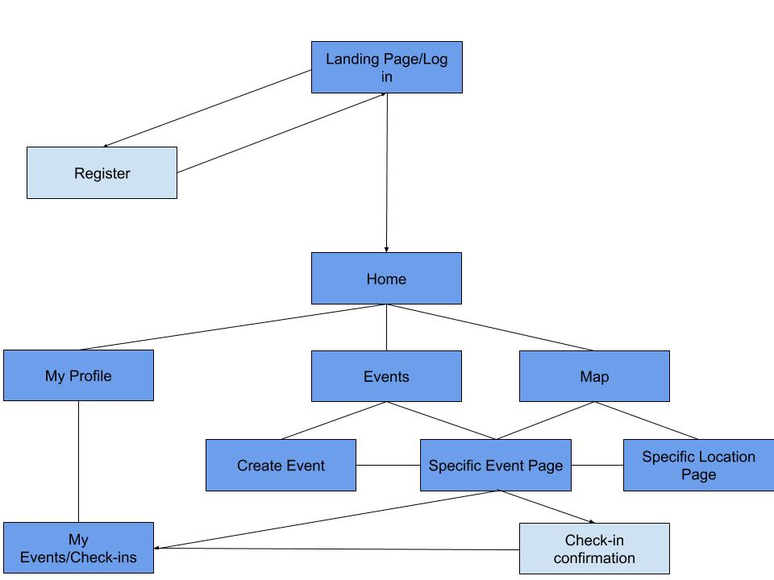

iOS Final Project Proposal

Author(s)

Justin Lee, Kevin Xu, Kwangi Yu
Project Title

Pawsome Time
Overview

A simple mobile app that allows users to meet up with other dog owners and allow their dogs to interact with each other. Great for dog birthday parties or meet ups at the dog park!
Intended Audience

Dog owners, social media users, anybody who likes dogs
Technical Challenges

Implementing a map with location markers
Implementing events
Implementing profiles
Potential friends list
Resources

CLLocation - gives latitude, longitude, and other details
UNUserNotificationCenter - Push Notifications
Firebase - database
Overall Logic and High-Level Flowchart

We will hold account information using firebase
Event information can also be held in the database
Home page can lead to the main 3 pages: profile, events, and map
You can create an event or view specific events from the events page
You can view specific events or view specific location page from the maps page

Mock-up screens and views

view ppt for mockup screens/views

Roles

Design + Back-end + Front-end
Kwangi Yu
Front-end
Kevin Xu
Back-end
Justin Lee

Projected Features

Registration/Login
Profile creation
View Map and nearby events
View Events
Create events, check-in/view events from events page

Additional Features

Friends List
